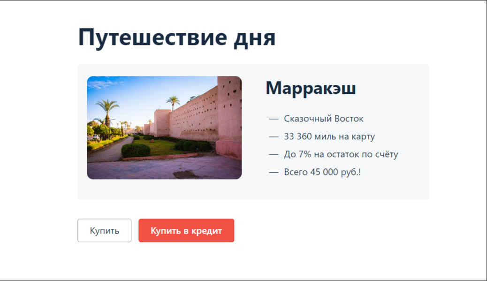

# Дипломный проект по итогам курса "Тестировщик ПО"

## Документация

* План выполнения работ
* Отчет о проведенном тестировании
* Отчет о проведенной автоматизации

## О проекте
Приложение представляет собой веб-сервис.

В данном сервисе реализована возможность покупки тура по определённой цене с помощью двух способов:

* Обычная оплата по дебетовой карте
* Выдача кредита по данным банковской карты

Само приложение не обрабатывает данные по картам, а пересылает их банковским сервисам:

* сервису платежей (Payment Gate)
* кредитному сервису (Credit Gate)

Сервис может взаимодействовать с СУБД MySql и PostgreSQL

База данных хранит информацию о заказах, платежах, статусах карт, способах оплаты.

## Цели проекта

В рамках проекта необходимо автоматизировать тестирование комплексного сервиса покупки тура, взаимодействующего с СУБД и API Банка.

### Для запуска приложения:

1. С помощью Git выполнить клонирование репозитория командой git clone https://github.com/ArtVysh/Diplom_QA.git;
2. Запустить Docker Desktop;
3. Открыть клонированный проект в IntelliJ IDEA;

### Запуск тестового приложения
1. Запустить MySQL, PostgreSQL и эмулятор банковских сервисов через терминал командой: `docker-compose up`
2. В новой вкладке терминала запустить тестируемое приложение:
* В режиме работы с MySQL: `java "-Dspring.datasource.url=jdbc:mysql://localhost:3306/app" -jar aqa-shop.jar`
* В режиме работы с PostgreSQL: `java "-Dspring.datasource.url=jdbc:postgresql://localhost:5432/app" -jar aqa-shop.jar`

3. Убедиться в готовности системы. Сервис должен быть доступен по адресу: `http://localhost:8080/`

### Запуск тестов
В новой вкладке терминала запустить тесты:
1. Для MySQL: `./gradlew clean test "-Ddb.url=jdbc:mysql://localhost:3306/app"`

2. Для PostgreSQL: `./gradlew clean test "-Ddb.url=jdbc:postgresql://localhost:5432/app"`
   

### Для просмотра отчетов по результатам тестирования:
1. Сгенерировать отчет Allure, выполнив команду в терминале IDEA: `./gradlew allureServe`
* Если отчет не открывается автоматически в браузере, то выполнить команду: `./gradlew allureReport` и открыть отчет вручную (файл index.html) по адресу: `.\build\reports\allure-report\allureReport`
2. При необходимости изменить подключение к другой БД потребуется остановить выполнение приложения в окне терминала нажатием комбинации клавиш `Ctrl + C`
