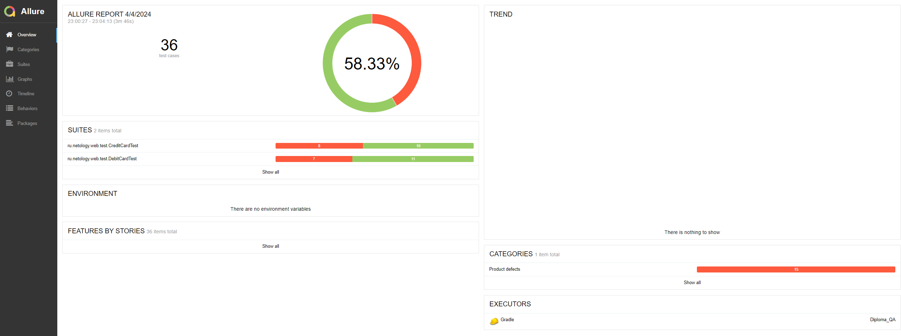
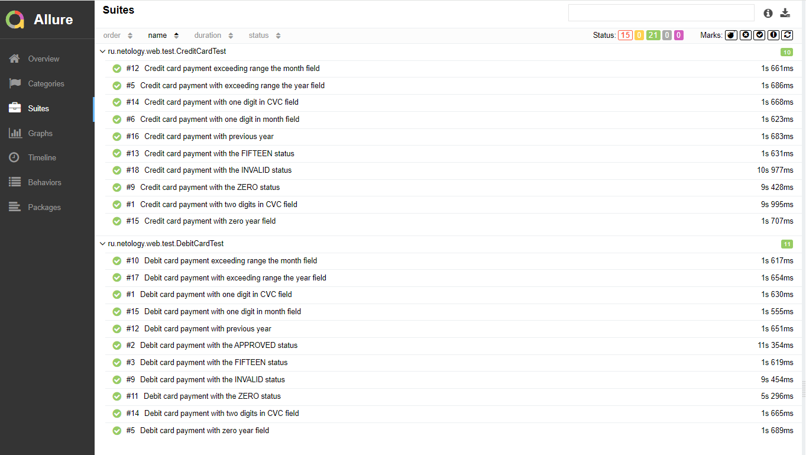
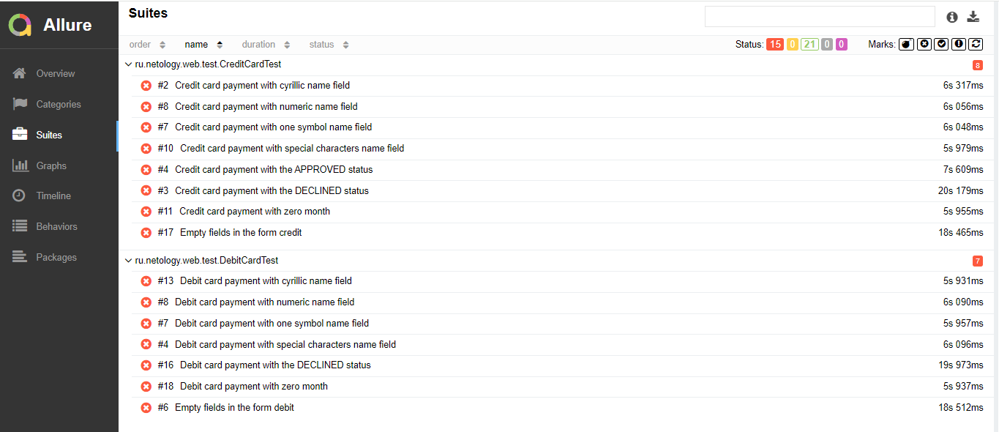

# Отчёт о проведённом тестировании

## 1. Краткое описание

В ходе выполнения дипломного проекта была реализована автоматизация тестирования функционала веб-сервиса "Путешествие дня".
Данный веб-сервис взаимодействует с СУБД и API Банка.

Было проведено тестирование следующих сервисов:
* Payment Gate (сервис платежей дебетовой картой);
* Credit Gate (сервис платежей в кредит по карте).

В ходе тестирования проверено взаимодействие сервисов с двумя СУБД:
* MySQL;
* PostgreSQL.

В качестве тестового окружения вместо реального банка применялся эмулятор, написанный на Node.js, запускаемый в отдельном контейнере.

## 2. Количество тест-кейсов

Всего реализовано 36 тест-кейсов

Успешных тест кейсов 21

Неуспешных тест-кейсов 15

## 3. Процент успешных/неуспешных тест-кейсов

- Процент успешных: 58.33%
- Процент неуспешных: 41.66%

## 4. Общие рекомендации

* Необходимо разработать документацию на проект, включая подробные функциональные требования.
* Необходимо привести приложение в соответствие требованиям стандарта PCI DSS.
* Требуется обратить внимание на валидацию полей форм. В частности встретились проблемы с полями "Владелец" и "месяц".
* Рекомендуется проработать возможность применения карт с 13, 15, 18 и 19 цифрами в номере. 
